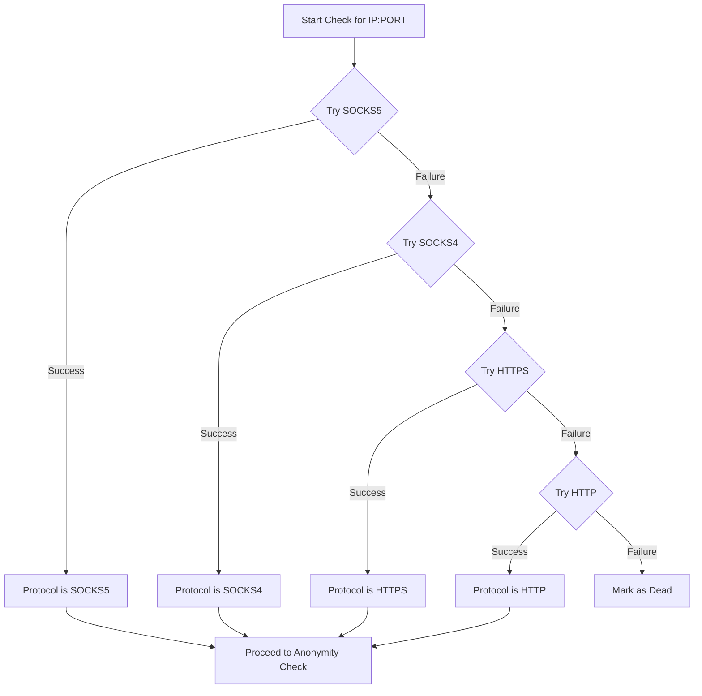

# Proxy Checker: Enhanced Features Architectural Plan

## 1. Introduction

This document outlines the architectural plan for enhancing the Python-based proxy checker with new features, including advanced protocol detection, anonymity level analysis, geolocation data retrieval, and testing against specific websites.

## 2. Current Architecture Overview

The application is built on `asyncio` and `aiohttp`, providing a solid foundation for asynchronous network operations. The core logic is encapsulated within the `ProxyValidator` class, which currently performs a basic liveness check. The `Proxy` and `ValidationResult` data models define the structure of the data.

## 3. Proposed Enhancements

### 3.1. Proxy Protocol Detection

**Objective:** Reliably detect the proxy protocol (HTTP, HTTPS, SOCKS4, SOCKS5).

**Strategy:**
The `ProxyValidator.check` method will be updated to attempt connections in a specific order of preference: SOCKS5, SOCKS4, HTTPS, and then HTTP. The first successful connection will determine the proxy's protocol.

**Library Recommendation:**
To enable SOCKS support within the `asyncio` environment, we will integrate the `aiohttp-socks` library. This library provides a `ProxyConnector` that can be used with `aiohttp` to handle SOCKS4 and SOCKS5 connections.

**Implementation Plan:**
1.  Add `aiohttp-socks` to the project's dependencies in `requirements.txt`.
2.  In `ProxyValidator`, instead of passing a simple `proxy_url` string to `session.get`, we will dynamically create a `ProxyConnector` from `aiohttp-socks` for SOCKS protocols.
3.  The `check` method's loop will be modified to instantiate the appropriate connector for each protocol being tested.



### 3.2. Anonymity Level Detection

**Objective:** Determine the anonymity level of a working proxy.

**Method:**
We will continue to use an external endpoint like `httpbin.org/get` to analyze the request headers forwarded by the proxy.

**Formal Criteria:**
The anonymity levels will be defined as follows:
-   **Elite:** The proxy does not add any identifying headers (like `Via`, `X-Forwarded-For`) and does not expose the client's real IP address.
-   **Anonymous:** The proxy adds identifying headers, indicating that a proxy is being used, but it does not expose the client's real IP address.
-   **Transparent:** The proxy exposes the client's real IP address, typically in the `X-Forwarded-For` or `Via` header.

**Implementation Plan:**
The `_get_anonymity` method in `ProxyValidator` will be updated to more strictly enforce these criteria. The set of `proxy_headers` to check for will be refined.

### 3.3. Geolocation Data

**Objective:** Fetch detailed geolocation data (Country, City, ISP) for each proxy.

**API Recommendations:**
1.  **ip-api.com:** The current free-tier API is a good starting point. It provides country, city, and ISP information. It has a rate limit of 45 requests per minute per IP address.
2.  **ipinfo.io:** A robust alternative that offers a free plan with up to 50,000 requests per month. It requires an API key.

We will start with `ip-api.com` and design the system to be easily configurable to switch to another provider like `ipinfo.io` if needed.

**Implementation Plan:**
1.  The `_get_geolocation` method in `ProxyValidator` will be updated to parse the JSON response for `country`, `city`, and `isp` fields.
2.  The `ValidationResult` model will be updated to store this structured information.

### 3.4. Testing Against Specific Websites

**Objective:** Allow users to test proxies against a list of custom URLs.

**Mechanism:**
A new command-line argument, `--test-urls`, will be introduced to accept a comma-separated list of URLs.

**Anti-Bot Measures:**
To handle basic anti-bot measures, the application will rotate the `User-Agent` header for each request made to the target websites. A list of common user agents will be included in the configuration.

**Implementation Plan:**
1.  Add the `--test-urls` argument to `parse_args` in `main.py`.
2.  Create a new method in `ProxyValidator`, such as `test_custom_url(url: str)`, which will perform a `GET` request to the given URL through the proxy.
3.  This method will cycle through a list of predefined `User-Agent` strings.
4.  The results of these tests (e.g., success/failure for each URL) will be stored in the `ValidationResult` object.

## 4. Data Model Updates

The `proxy_checker/models.py` file will be updated to store the new information.

**Proposed `ValidationResult` update:**

```python
from dataclasses import dataclass, field
from typing import Optional, Dict

@dataclass
class Geolocation:
    country: str = "Unknown"
    city: str = "Unknown"
    isp: str = "Unknown"

@dataclass
class ValidationResult:
    """Stores the results of a proxy validation."""
    proxy: Proxy
    is_working: bool = False
    protocol: Optional[str] = None
    latency: float = -1.0  # in milliseconds
    anonymity: str = "Unknown"
    geolocation: Geolocation = field(default_factory=Geolocation)
    website_tests: Dict[str, bool] = field(default_factory=dict)
    error: Optional[str] = None
```

## 5. Summary

This plan provides a comprehensive roadmap for extending the proxy checker's functionality. By implementing these features, the tool will become significantly more powerful and useful for a wider range of tasks.
