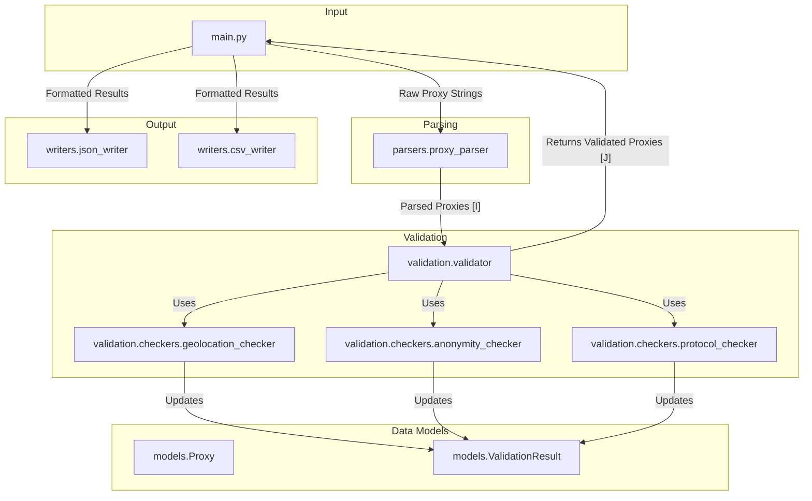

# Architectural Plan: Code Quality and Robustness

## 1. Introduction

This document outlines a detailed plan to refactor the Python-based proxy checker for improved code quality, robustness, and maintainability. The proposed changes address project structure, error handling, and output formats.

## 2. Proposed Project Structure

To enhance modularity and separation of concerns, the project will be restructured as follows:

```
proxy_checker/
├── __init__.py
├── config.py
├── models.py
├── main.py
|
├── parsers/
│   ├── __init__.py
│   └── proxy_parser.py
|
├── validation/
│   ├── __init__.py
│   ├── validator.py
│   └── checkers/
│       ├── __init__.py
│       ├── anonymity_checker.py
│       ├── geolocation_checker.py
│       └── protocol_checker.py
|
├── writers/
│   ├── __init__.py
│   ├── base_writer.py
│   ├── csv_writer.py
│   └── json_writer.py
|
└── utils/
    ├── __init__.py
    └── http_client.py
```

### Component Interaction Diagram



## 3. Comprehensive Error-Handling Strategy

A robust error-handling strategy will be implemented to distinguish between expected failures and application bugs.

### Custom Exception Classes

A new file, `proxy_checker/exceptions.py`, will define custom exceptions:

```python
class ProxyCheckerError(Exception):
    """Base exception for the application."""
    pass

class ProxyParsingError(ProxyCheckerError):
    """Raised when a proxy string cannot be parsed."""
    pass

class GeolocationError(ProxyCheckerError):
    """Raised when the geolocation API lookup fails."""
    pass

class AnonymityCheckError(ProxyCheckerError):
    """Raised when the anonymity check fails."""
    pass
```

### Error Handling Flow

```mermaid
graph TD
    subgraph "Validator"
        A[validator.check]
        A --> B{Try Protocol};
        B -- Network Error e.g., Timeout --> C[Log as DEBUG, Try Next Protocol];
        B -- Unexpected Error --> D[Log as ERROR, Return Failed Result];
        B -- Success --> E{Perform Sub-Checks};
        E -- Geolocation Fails --> F[Catch GeolocationError, Log as DEBUG];
        F --> G[Set geolocation to 'Error', Continue];
        E -- Anonymity Fails --> H[Catch AnonymityCheckError, Log as DEBUG];
        H --> I[Set anonymity to 'Unknown', Continue];
        I --> J[Return Success Result]
        G --> J
    end

    subgraph "Main"
        K[main.py]
        K --> L[asyncio.gather(tasks)];
        L -- Returns Exception --> M{Inspect Exception Type};
        M -- Is ProxyCheckerError --> N[Log as DEBUG: "Proxy validation failed"];
        M -- Is Unexpected Exception --> O[Log as ERROR: "Critical error during validation"];
    end

    Validator --> Main
```

## 4. Structured Output Formats

The application will support **JSON** and **CSV** output formats to provide structured, machine-readable results.

### JSON Output Example

```json
{
  "proxy": "socks5://1.2.3.4:1080",
  "protocol": "socks5",
  "latency_ms": 120.5,
  "anonymity": "Elite",
  "geolocation": {
    "country": "United States",
    "city": "Mountain View",
    "isp": "Google LLC"
  },
  "website_tests": {
    "https://www.google.com/": true,
    "https://www.example.com/": true
  }
}
```

### CSV Output Example

```csv
proxy,protocol,latency_ms,anonymity,country,city,isp,test_url_1,test_url_2
socks5://1.2.3.4:1080,socks5,120.5,Elite,"United States","Mountain View","Google LLC",true,true
```

This plan provides a clear roadmap for refactoring the proxy checker. The next step is to implement these changes in `code` mode.