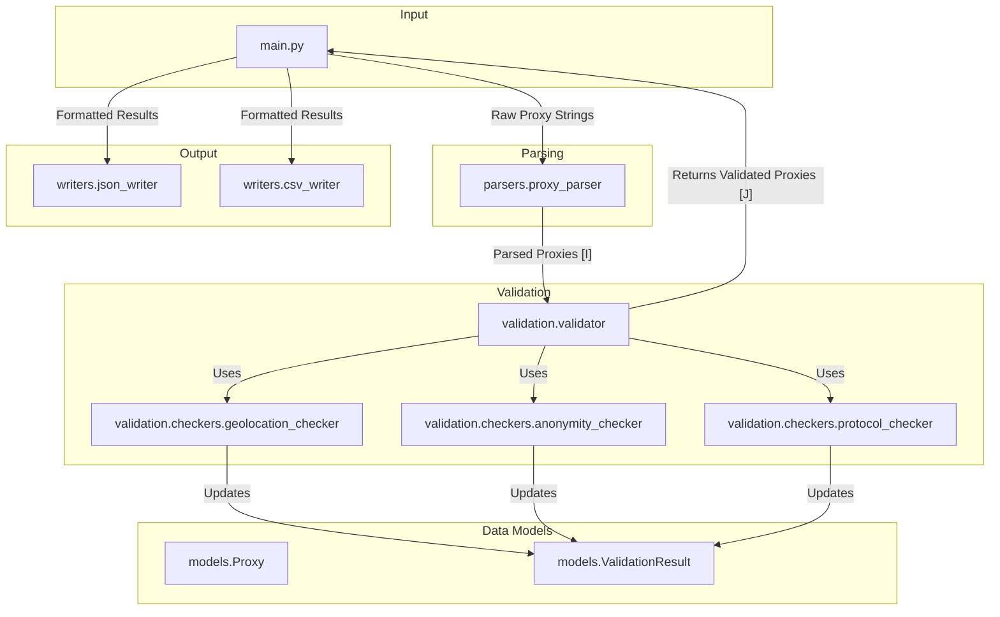

# Comprehensive Code Review and Enhancement Plan

## 1. High-Level Summary

This document provides a unified architectural plan for the Python-based proxy checker, consolidating strategies for code quality, new features, and performance. The goal is to create a robust, modular, and feature-rich application.

The plan involves three key areas:
1.  **Code Quality and Robustness:** Refactoring the project structure, implementing comprehensive error handling, and standardizing output formats.
2.  **New Feature Enhancements:** Adding protocol detection (SOCKS4/5, HTTP/S), anonymity analysis, geolocation, and testing against specific websites.
3.  **Data Models and Output:** Updating data models to store enhanced information and providing structured output in JSON and CSV formats.

---

## 2. Code Quality and Robustness

To improve maintainability and separation of concerns, the project will be refactored.

### 2.1. Proposed Project Structure

```
proxy_checker/
├── __init__.py
├── config.py
├── models.py
├── main.py
├── exceptions.py
|
├── parsers/
│   ├── __init__.py
│   └── proxy_parser.py
|
├── validation/
│   ├── __init__.py
│   ├── validator.py
│   └── checkers/
│       ├── __init__.py
│       ├── anonymity_checker.py
│       ├── geolocation_checker.py
│       └── protocol_checker.py
|
├── writers/
│   ├── __init__.py
│   ├── base_writer.py
│   ├── csv_writer.py
│   └── json_writer.py
|
└── utils/
    ├── __init__.py
    └── http_client.py
```

### 2.2. Component Interaction



### 2.3. Comprehensive Error-Handling

Custom exceptions will be defined in `proxy_checker/exceptions.py` to handle specific failures gracefully.

**Custom Exceptions:**
- `ProxyCheckerError`: Base exception.
- `ProxyParsingError`: For failures in parsing proxy strings.
- `GeolocationError`: For failures in geolocation API lookups.
- `AnonymityCheckError`: For failures during anonymity checks.

**Error Handling Flow:**
The validator will catch expected errors (like timeouts or API failures) and log them appropriately without stopping the entire process. Unexpected errors will be logged as critical.

---

## 3. New Feature Enhancements

The following features will be added to enhance the proxy checker's capabilities.

### 3.1. Proxy Protocol Detection

-   **Objective:** Detect SOCKS4, SOCKS5, HTTP, and HTTPS protocols.
-   **Strategy:** Attempt connections sequentially (SOCKS5 -> SOCKS4 -> HTTPS -> HTTP). The first success determines the protocol.
-   **Library:** `aiohttp-socks` will be used for SOCKS support.

### 3.2. Anonymity Level Detection

-   **Objective:** Determine if a proxy is Elite, Anonymous, or Transparent.
-   **Method:** Analyze headers returned by `httpbin.org/get`.
    -   **Elite:** No identifying headers.
    -   **Anonymous:** Proxy-identifying headers are present, but the real IP is hidden.
    -   **Transparent:** Real IP is exposed.

### 3.3. Geolocation Data

-   **Objective:** Fetch Country, City, and ISP for each proxy.
-   **API:** `ip-api.com` will be used initially, with a design that allows easy switching to other providers like `ipinfo.io`.

### 3.4. Testing Against Specific Websites

-   **Objective:** Allow users to test proxies against a list of custom URLs.
-   **Mechanism:** A new `--test-urls` argument will accept a list of URLs. The application will rotate `User-Agent` headers to mitigate basic anti-bot measures.

---

## 4. Data Models and Output

### 4.1. Updated Data Model

The `ValidationResult` data model in `proxy_checker/models.py` will be updated to store the new information.

```python
from dataclasses import dataclass, field
from typing import Optional, Dict

@dataclass
class Geolocation:
    country: str = "Unknown"
    city: str = "Unknown"
    isp: str = "Unknown"

@dataclass
class ValidationResult:
    """Stores the results of a proxy validation."""
    proxy: Proxy
    is_working: bool = False
    protocol: Optional[str] = None
    latency: float = -1.0  # in milliseconds
    anonymity: str = "Unknown"
    geolocation: Geolocation = field(default_factory=Geolocation)
    website_tests: Dict[str, bool] = field(default_factory=dict)
    error: Optional[str] = None
```

### 4.2. Structured Output Formats

The application will support **JSON** and **CSV** output.

**JSON Example:**
```json
{
  "proxy": "socks5://1.2.3.4:1080",
  "protocol": "socks5",
  "latency_ms": 120.5,
  "anonymity": "Elite",
  "geolocation": {
    "country": "United States",
    "city": "Mountain View",
    "isp": "Google LLC"
  },
  "website_tests": {
    "https://www.google.com/": true
  }
}
```

**CSV Example:**
```csv
proxy,protocol,latency_ms,anonymity,country,city,isp,test_url_1
socks5://1.2.3.4:1080,socks5,120.5,Elite,"United States","Mountain View","Google LLC",true